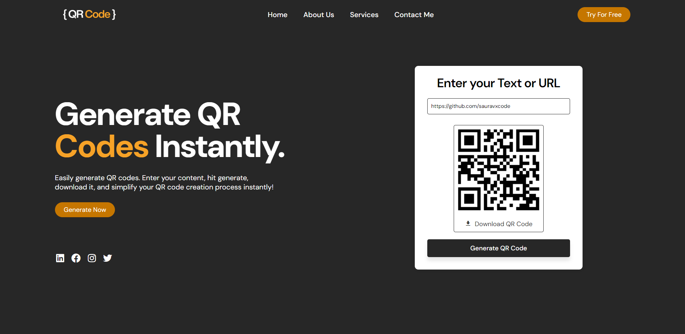

# QR Code Generator

## Description
This project is a simple QR code generator implemented using HTML, CSS, and JavaScript. It allows users to generate QR codes from text or URLs instantly.

## Features
- Generate QR codes from text or URLs.
- Download generated QR codes.
- Responsive design for various screen sizes.

## Support
For support or inquiries, please contact me via:
- Email: inquery.saurav@gmail.com
- LinkedIn: [Saurav Chaturvedi](https://www.linkedin.com/in/isaurav/)

## Preview

